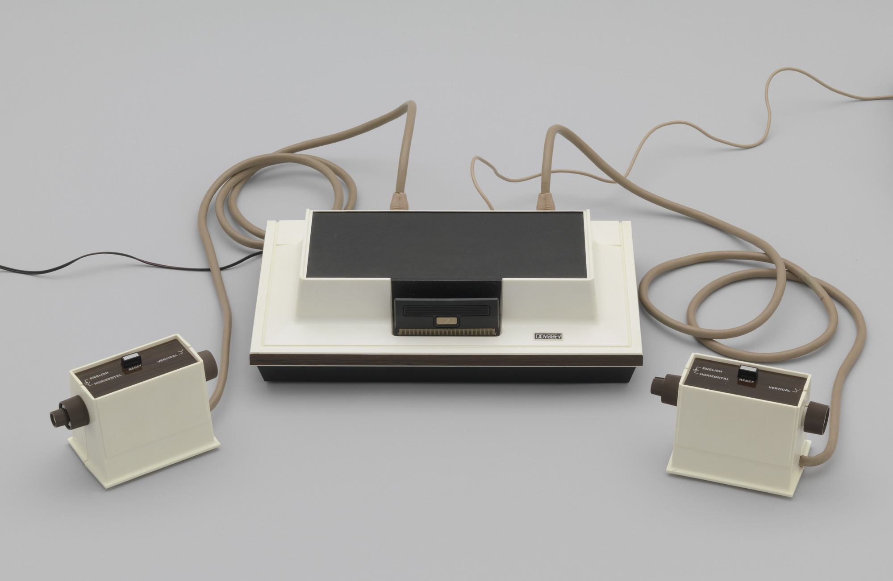

<!DOCTYPE html>
<html lang="fr">
	<head>
		<meta charset="utf-8">
		<title>
			Les jeux vidéos
		</title>
		<link rel="stylesheet" href="Style.css">
		
	</head>
	<body>
		<!--
		faudrat mettre un en-tete qui meme si on scroll reste en haut de l'écran et qui permet de choisir la langue 
		(en java voir site https://pixees.fr/informatiquelycee/n_site/nsi_prem_js.html + mon site sur star wars)
		-->
		

			

				Inscris toi : <button onclick="window.location.href='formulaire jeu.html';"> Inscription</button>
			

			

				Choisis ta langue : <button onclick="anglais()"> Anglais </button>
			

		

		

		 
		<h1 id="titre1"> 
			L'histoire du Jeu vidéo 
		</h1>
		

			Nous allons vous présenter l'histoire incroyable qu'a vécu le jeu vidéo. Nous partirons des premier jeux vidéos créés au monde, 
			en passant par l'apparition des consoles et donc de certaines entreprise aujourd'hui mondialement connu 
			pour arrivé à aujourd'hui.
		

		 
			<ul>
				<li>
					<h2 id="petitTitre1">
						Qu'est ce qu'un jeu vidéo ?
					</h2>
				</li>
				

					Selon <a href="https://fr.wikipedia.org/wiki/Jeu_vidéo" id="lien1"> Wikipédia</a> un jeu vidéo est un jeu électronique doté d'une interface utilisateur 
					permettant une interaction humaine ludique en générant un retour visuel sur un dispositif vidéo. Le joueur de jeu vidéo dispose de périphériques 
					pour agir sur le jeu et percevoir les conséquences de ses actes sur un environnement virtuel. Le mot « vidéo » dans le jeu vidéo fait traditionnellement
					référence à un dispositif d'affichage de trame, mais, à la suite de la vulgarisation du terme, il implique désormais tout type de dispositif d'affichage
				

				<li>
					<h2>
						Les premiers Jeux Vidéo:
					</h2>
				</li>
				
				<iframe width="240" height="160"
					src="https://www.youtube.com/watch?v=fiShX2pTz9A&ab_channel=andys-arcade?autoplay=1&mute=1&loop=1">
					<!--
					trouver probleme car yt n'autorise pas la vidéo (l'enregistré)
					-->
				</iframe>
				

					Pong, sorti en 1972 par Atari, n'est pas réelement le premier jeu vidéo créé mais le premier jeux a rencontrer un véritable succès commerciale. En effet, selon 
					<a href="https://plarium.com/fr/blog/le-premier-jeu-video/"> Palarium</a> l'un des premiers jeu vidéo à être créé serait "Bertie the Brain" en 1950 
					fait par l'inventeur Josef Kates. Il permettait de jouer à un jeu d’enfance, connu sous le nom de Morpion, et a été exhibé lors de l’Exposition nationale canadienne.
				

				<li>
					<h2>
						Les premières consoles :
					</h2>
				</li>
				
				

					La première console de jeu a être commercialisé est <a href="https://fr.wikipedia.org/wiki/Magnavox_Odyssey"> l'Odyssé</a> par Magnavox en 1972 aux Etats-Unis et 1973 dans le monde entier.			
				

				<li>
					<h2>
						Zoom sur des entreprises:
					</h2>
				</li>
				<ul>
					<li>
						<h3>
							Nintendo:
						</h3>
					</li>
					

						Contrairement a se qu'on pourrait penser, Nintendo n'a pas vendu que des consoles et des jeux vidéos dans son histoire. Effectivement l'entreprise étant créé en 1889 
						et le premier jeu vidéo commercialisé était en 1972 l'entreprise a donc existé 83 ans sans jeux vidéos. Qu'a t-elle donc vendu ou fait pendant tout ce temps ?
						 
						Nintendo créé en 1889 par Fusajiro Yamauchi, était une petite entreprise artisanal créant... des cartes à jouer ! ou des hanafuda en Japonais
					

					<li>
						<h3>
							Ubisoft:
						</h3>
					</li>
					

						Ubisoft (anciennement Ubi Soft Entertainment) est une entreprise française de développement, d'édition et de distribution de jeux vidéo, 
						créée en mars 1986 par les cinq frères Guillemot, originaires de Carentoir dans le Morbihan, en France.En 2015, elle se définit 
						comme le troisième plus grand éditeur indépendant du monde.Ubisoft est détenteur de nombreuses franchises à succès telles que Rayman,
						Prince of Persia, Tom Clancy, Assassin's Creed, Far Cry, Just Dance, Watch Dogs, Driver.La société s'est diversifiée en transposant 
						ses franchises de jeux vidéo dans les domaines de la bande dessinée depuis 2009 avec Les Deux Royaumes et du cinéma et de la télévision 
						depuis 2011 avec sa filiale Ubisoft Motion Pictures.
					

					<li>
						<h3>
							Valve:
						</h3>
					</li>
					

						Valve Corporation est un studio américain de développement, un éditeur et un distributeur de jeux vidéo créé en 1996 et basé à Bellevue, 
						dans l'État de Washington. Valve est devenu célèbre après la sortie de son premier jeu, Half-Life, en novembre 1998. 
						Le studio a prolongé le succès d'Half-Life en développant des mods, des spin-off et des jeux, parmi lesquels on compte Half-Life 2, 
						Counter-Strike, Team Fortress et Dota 2. Valve est également connu pour être le précurseur et leader dans la distribution numérique 
						de contenus de jeux vidéos, avec sa plateforme Steam.
					

				</ul>
				<li>
					<h2>
						Fin :
					</h2>
				</li>
				

					Merci d'avoir lu ma page sur l'histoire du jeux vidéo, si vous souhaité voir mes jeux vidéo préférés je vous invite à cliquer <a href="jeu vidéo page 2.html"> ici</a> .
				

			</ul>
		

	</body>
</html>
